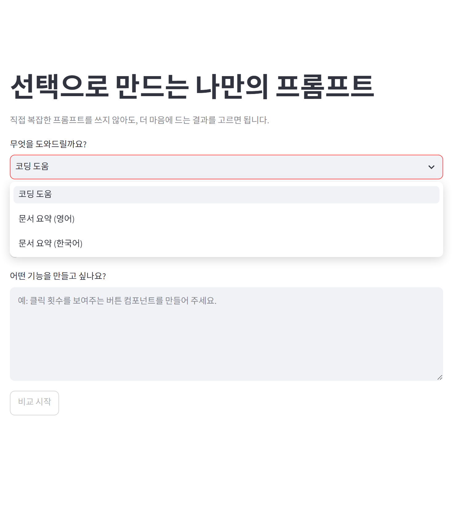
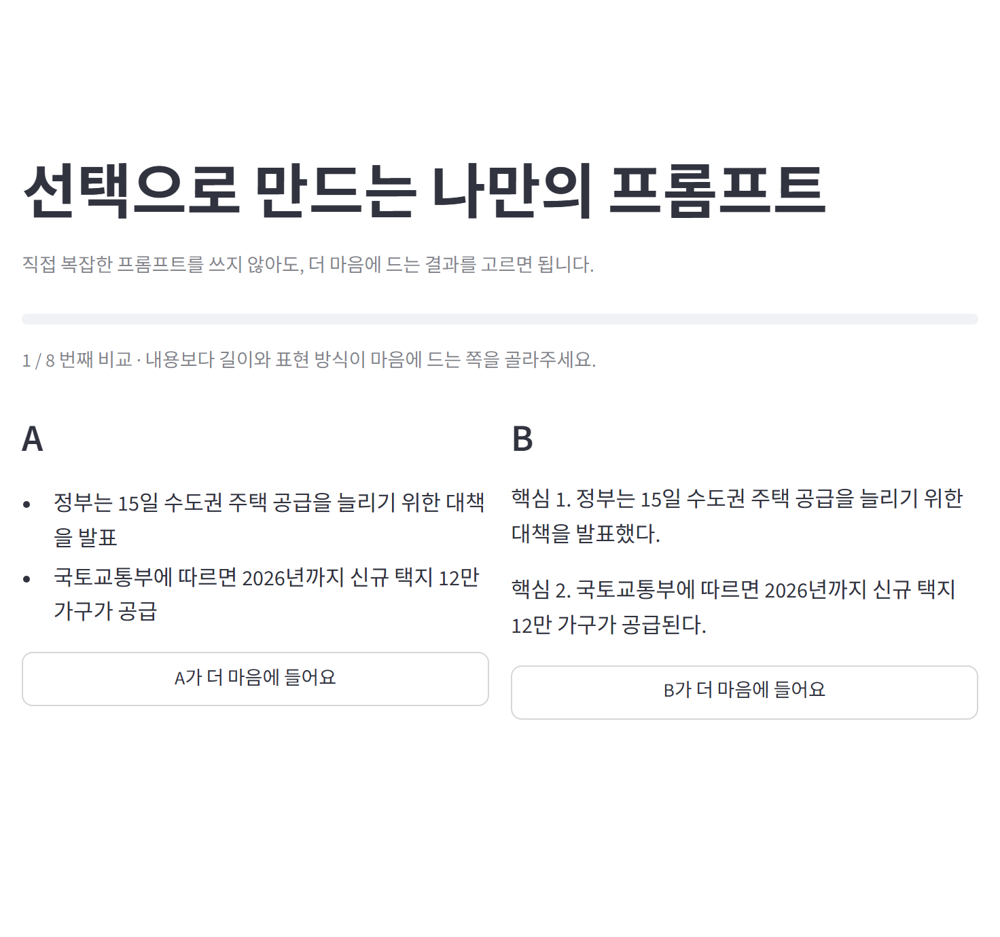
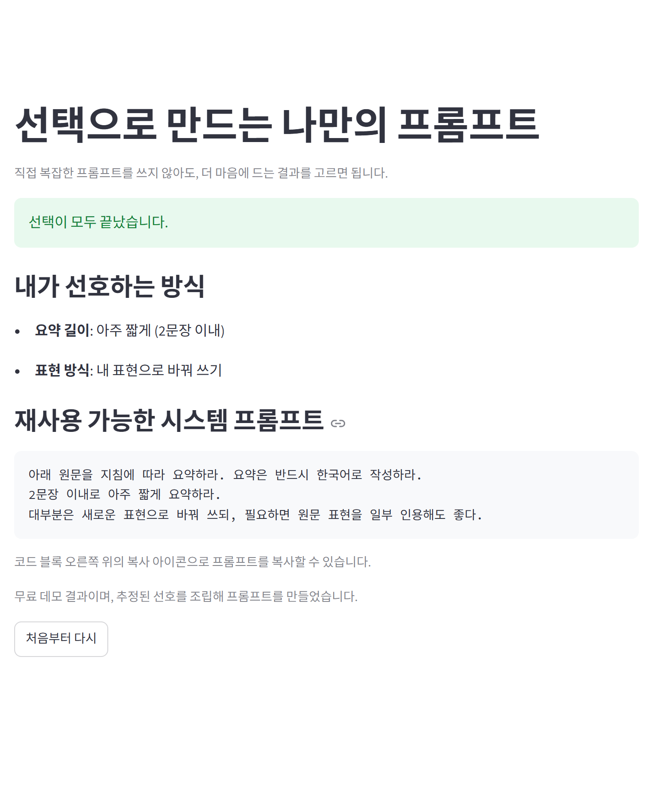
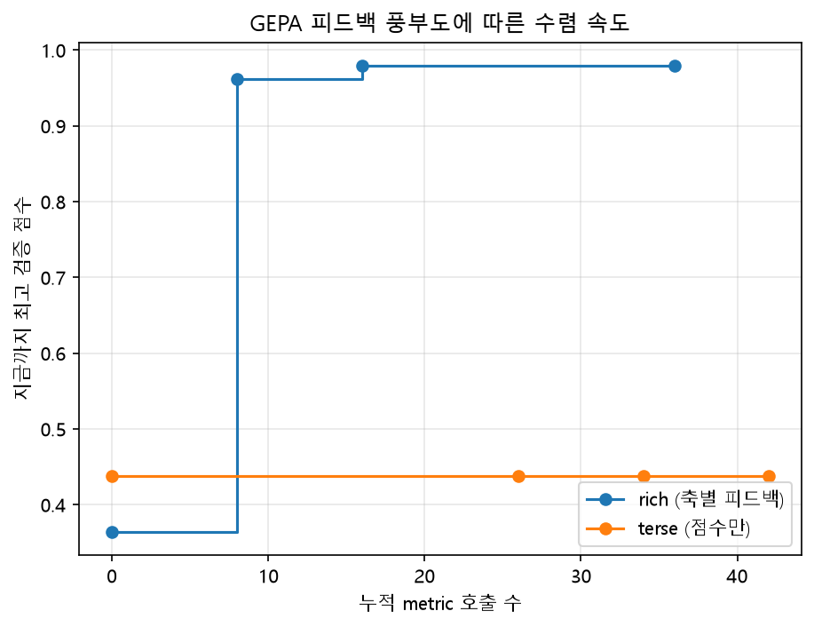
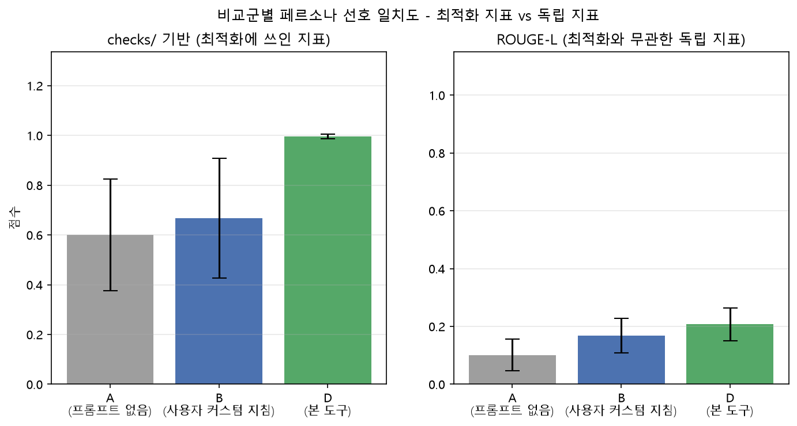
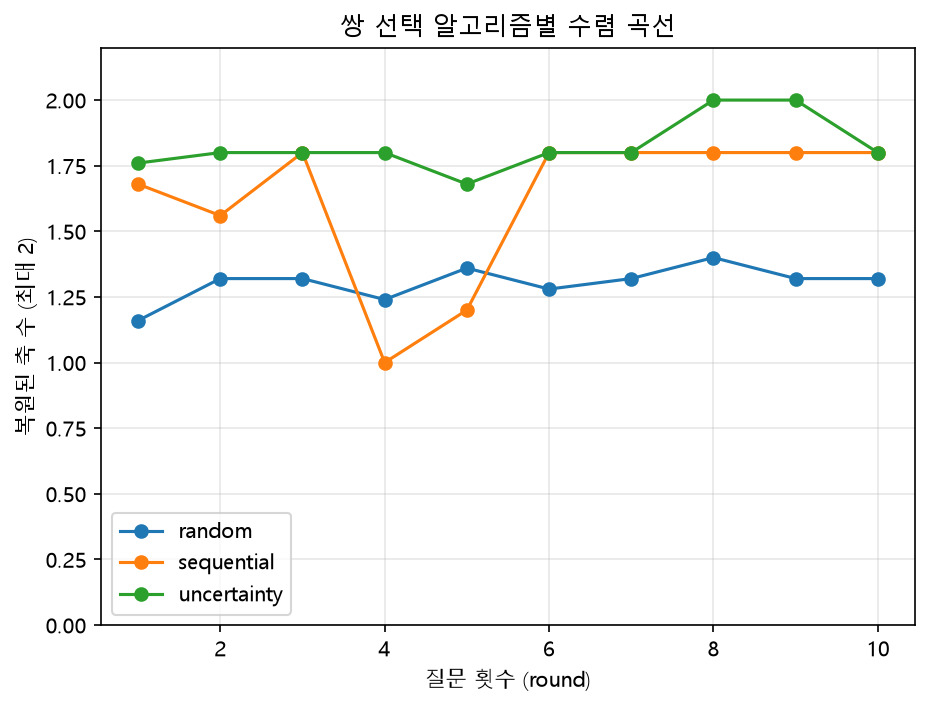
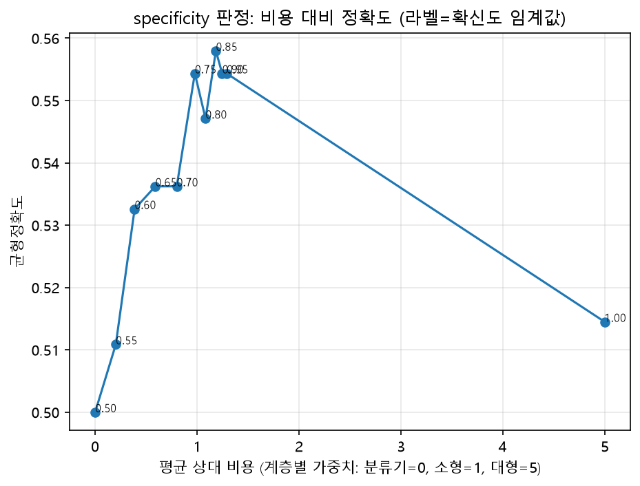
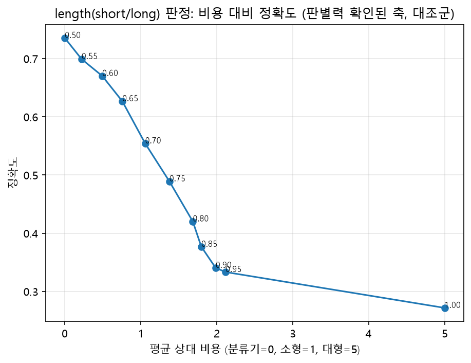

# 선호 기반 프롬프트 자동 생성 도구

사용자가 결과물 두 개 중 마음에 드는 쪽을 8~10회 고르면, 그 선택 이력에서
사용자의 암묵적 선호를 추정하고, 이를 평가 함수로 변환해 자동 프롬프트
최적화기([GEPA](https://arxiv.org/abs/2507.19457))에 전달한다. 최종
산출물은 그 사용자 전용 시스템 프롬프트 텍스트 한 덩어리다.

현재 MVP는 이 방식을 TypeScript/React 코딩 스타일 개인화로 확장했다.
사용자가 코드 A/B 예시 중 더 마음에 드는 결과를 고르면 코드 구성, 스타일
관리, 타입 작성 선호를 반영한 재사용 가능한 시스템 프롬프트를 만든다.
기존 문서 요약 도메인과 공통 엔진은 그대로 유지한다.

핵심 전환: 기존 개인화 수단은 "당신이 원하는 것을 서술하세요"에서
출발한다. 본 도구는 "이 둘 중 나은 쪽을 고르세요"에서 출발한다.

**이 프로젝트가 하지 않는 것**
- 언어 모델을 학습하거나 파인튜닝하지 않는다. 상용 API를 부품으로 호출만 한다.
- "범용적으로 좋은 프롬프트"를 목표로 하지 않는다. 개인 적합도가 목표다.

**바로 써보기**: https://preference-prompt-tool-7c9fvm3tb5bfxv8v6648fu.streamlit.app/

API 키 없이도 무료 데모 모드로 전체 흐름을 돌려볼 수 있다. 첫 접속 시
앱이 절전 상태면 깨우는 데 30초쯤 걸린다.



카테고리를 고르고 원문을 넣으면, 축 조합이 다른 결과물 두 개가 나온다.
어느 축이 다른지는 알려주지 않는다 - 사용자는 그냥 마음에 드는 쪽을 고른다.



8회를 고르면 추정된 선호와 재사용 가능한 시스템 프롬프트가 나온다.



프로젝트의 상세한 설계 결정과 그 이유(무엇을 왜 바꿨는지 포함)는
[`CLAUDE.md`](CLAUDE.md)에 기록되어 있다.

---

## 결과 요약

**선택 기반 개인화는 작동한다. 다만 모든 취향 축이 측정 가능한 것은
아니며, 어떤 축이 그러한지를 실험으로 구분했다.** 아래는 성공(개인화·
수렴·확장성·피드백 효과)과 한계(specificity 축, 에이전트의 축 발견)를
같은 비중으로 보고한다 - 유리한 지표만 골라 보고하지 않는다.

### 성공

#### 1. GEPA 피드백 풍부도 어블레이션 — 가장 인과관계가 깨끗한 결과

`engine/metric_builder.py`가 만드는 축별 자연어 피드백("길이 위반: 6문장
(목표 2문장 이하)...")이 GEPA 성찰에 실제로 도움이 되는지 검증했다
(`experiments/feedback_richness_ablation.py`). **점수 계산 함수는 완전히
동일하게 두고**, GEPA에게 보이는 피드백 텍스트만 rich(축별 위반 내역) vs
terse(점수만)로 바꿔 같은 호출 예산(40회) 안에서 도달하는 검증 점수를
비교했다.



**rich 0.98 vs terse 0.44.** rich는 8회 만에 급격히 수렴해 그 수준을
유지하는 반면, terse는 40회 내내 정체된다. 다른 변수 없이 피드백 형식
하나만 바꿔서 나온 차이라 인과관계가 가장 깨끗하고, "우리는 축을
명시적으로 갖고 있어서 구조화된 피드백을 줄 수 있고, 범용 최적화 도구는
못 하는 부분"이라는 이 프로젝트의 기여 주장에 대한 유일한 직접 증거다.

재현: `python -m experiments.feedback_richness_ablation`

#### 2. 개인화 효과: 비교군 A · B · D

각 조건의 산출물이 페르소나(MACSum 데이터의 실제 속성 조합)의 진짜 선호와
얼마나 일치하는지 두 가지 지표로 채점 (5개 문서 평균).

- **checks_score**: `checks/summarization.py` 기반 - **D의 최적화 목표와
  동일한 함수이므로 D에 유리하게 기울어 있다.** 이 지표 하나만 보고하면
  순환 논증이 된다.
- **independent_score (ROUGE-L)**: 최적화에 전혀 쓰이지 않은 별도
  알고리즘(LCS 기반)으로 MACSum 사람 작성 정답 요약과 직접 비교
  (`experiments/independent_grader.py`).

| 조건 | checks_score (최적화 목표와 동일 계열) | ROUGE-L (독립) |
|---|---|---|
| A - 프롬프트 없이 기본 호출 | 0.600 ± 0.224 | 0.101 ± 0.055 |
| B - 사용자가 직접 쓴 일반적인 지침 | 0.668 ± 0.240 | 0.168 ± 0.060 |
| D - 본 도구 (8회 비교 → 자동 조립된 프롬프트) | 0.996 ± 0.010 | 0.207 ± 0.057 |



checks_score는 D의 최적화 목표와 동일 계열의 함수이므로 D에 유리하다.
이를 보완하기 위해 최적화에 전혀 쓰이지 않은 ROUGE-L로 재채점했고,
**절대값은 크게 낮아진다** (D 기준 0.996 → 0.207, B 대비 상대적으로는
checks 기준 +49%, ROUGE-L 기준 +23% - 두 지표 다 B 대비 %p 차이 자체는
작다: checks +32.8%p, ROUGE-L +3.9%p).

ROUGE-L에서 D(0.207 ± 0.057)와 B(0.168 ± 0.060)의 차이(0.039)는 표준편차
보다 작아 평균만으로 "우위"라 단정하기엔 근거가 약하다. 문서 5개
각각에서 D와 B를 직접 비교(페어드)하면 **D가 5개 중 4개에서 B보다
높았다** (나머지 1개는 -0.0012로 사실상 동률). 표본이 5개뿐이라
통계적 유의성을 주장하지는 않지만, 평균 비교보다는 이 페어드 결과가
더 설득력 있는 근거다. 절대값이 낮아지는 것도 감추지 않고 두 지표를
나란히 보고한다 - 이게 0.996만 내세우는 것보다 방어 가능한 주장이다.

재현: `python -m experiments.compare_baselines`

#### 3. 쌍 선택 알고리즘 비교: 무작위 vs 순차 질의 vs 불확실도 기반

실제 API 호출로 생성한 후보를 실제 MACSum 답안지 기준(`checks/`)으로
채점하는 오라클을 오간 선택 루프를 8~10회 돌려, 숨겨진 페르소나의 축별
선호(length, extractiveness)를 얼마나 잘/빨리 복원하는지 비교
(5문서 × 5시드 평균).



- **무작위**: 10라운드까지도 1.3/2축 정체, 완전복원 32%
- **축 순차 질의**: 1.8/2축, 완전복원 80%
- **불확실도 기반**: 8~9라운드에 2.0/2축 완전 도달, 완전복원 80%

재현: `python -m experiments.run_all` → `python -m experiments.plots`

#### 4. 확장성 검증: 도메인 + 언어

`domains/email.yaml` + `checks/email.py`만 추가하고 `engine/` 코드는 한
줄도 고치지 않고 완전히 다른 도메인(이메일 초안, 축 3개: 길이·격식·구조)이
동작함을 확인했다 (`tests/test_extensibility.py`). `engine/`의 코드에는 도메인
특정 단어가 등장하지 않는다 - 축 이름·값·프롬프트 문구·검사 함수는 전부
`domains/*.yaml`에서 읽는다.

**언어 이식성도 같은 방식으로 검증**: `domains/summarization_ko.yaml` +
`checks/summarization_ko.py`(Kiwi 형태소 분석기로 조사·어미를 제거하고
비교)만 추가해 한국어 요약 도메인도 `engine/` 무수정으로 동작함을 확인
(`tests/test_korean_extensibility.py`). 다만 한국어는 MACSum 같은 사람 주석
답안지가 없어 정량 복원율은 내지 않고, 파이프라인 완주와 검사 함수
스팟 체크로 범위를 제한했다 - short+fully 조합은 원문과 형태소 겹침
94%, long+normal 조합은 40%로 명확히 갈렸다.

이 한국어 도메인은 웹 UI에도 "문서 요약 (한국어)" 카테고리로 연결돼
있다. 배포 환경에는 Kiwi를 넣지 않는데(모델 데이터 88MB가 `Kiwi()`
생성 시 램에 올라가 Streamlit Community Cloud 무료 티어에 부담), 대신
사전이 필요 없는 **문자 4-gram 겹침** fallback을 둔다. 사전 없이 어절
끝 조사를 규칙으로 떼는 방식은 "전문가"의 "가"를 주격 조사로 오인해
중간 대역에서 겹침을 0.59 -> 0.47로 떨어뜨렸고(임계값 0.5를 잘못 넘음),
문자 n-gram은 조사가 어절 뒤에 붙는 한국어 특성상 그 문제가 없다.
n=4가 Kiwi 형태소 bigram 겹침과 가장 잘 맞았다 - 원문 3종 x 발췌
문장수 4단계 x 어절 누락률 6단계 72케이스에서 임계값 판정 **일치율
97%**, 평균 오차 0.035, r=0.977이고 Kiwi 값으로의 회귀 기울기가 1.07/
절편 -0.07로 거의 항등이라 두 백엔드가 같은 YAML 임계값을 공유한다
(n=2는 57%, n=3은 67%, n=5는 82%). **보고된 한국어 수치는 전부 Kiwi
기준**이며, 실험 환경이 조용히 fallback으로 내려앉지 않도록
`tests/test_korean_checks_backends.py`가 Kiwi가 깔린 환경에서는 Kiwi
백엔드가 쓰이는 것을 검사한다.

**과제 카테고리 자체도 확장**: 요약(이 프로젝트)·코딩(팀원) 외에 완전히
다른 과제인 **고객 리뷰 작성**을 추가했다 (`domains/review.yaml` +
`checks/review.py`). 축은 length(길이)·sentiment(어조)·topic(초점).
sentiment 축의 어휘 사전·임계값은 실제 Yelp 리뷰 3,000건(별점 기반
라벨, `experiments/review_dataset.py` - HuggingFace datasets-server를
HTTP로 직접 호출해 새 라이브러리 없이 받음)으로 먼저 검증했다 - negative
평균 -0.0022 → neutral 0.019 → positive 0.0392로 단조 증가, specificity
축(6주차)과 달리 진짜 판별력이 있다. 실제 생성 결과로도 6회 선택 루프가
선호(short+positive)를 정확히 학습했고 `engine/` 코드는 무수정이다
(`tests/test_review_domain.py`).

---

### 한계 — 모든 축이 측정 가능하지는 않다

#### 5. specificity 축: 다섯 가지 방법 전부 실패

규칙 기반(정규식), 언어학적 도구(spaCy NER), 학습형 분류기(TF-IDF+
로지스틱회귀), 소형 LLM, 대형 LLM - **총 다섯 가지 방법으로 측정을
시도했으나 전부 우연 수준에 머물렀다.** 하나 해보고 포기한 게 아니라
성격이 다른 다섯 접근을 다 시도했다는 게 핵심이다.

| 계층 | 균형정확도 (요약문만) | 균형정확도 (원문 포함) |
|---|---|---|
| 정규식 | 판별력 없음 (6주차) | - |
| spaCy NER | 판별력 없음 (6주차) | - |
| 학습형 분류기 (TF-IDF+로지스틱회귀) | 0.500 (우연) | - |
| 소형 LLM | 0.525 | 0.558 |
| 대형 LLM | 0.464 | 0.514 |

이는 구현 미비가 아니라 **해당 축이 이 데이터에서 표면적으로 판별 가능한
형태로 존재하지 않음을 시사한다.**



확신도 0.85에서 정확도가 최고점을 찍고 대형 모델에 전부 맡기면(임계값
1.0) 오히려 떨어지는 이 곡선은 **판별력이 확인되지 않은 축에서 잰
것이라 최적 임계값 자체를 그대로 믿기는 어렵다** - 우연 근방(0.46~0.56)
에서의 봉우리는 노이즈일 가능성이 크다.

이 곡선이 노이즈인지 확인하려고, 판별력이 이미 확인된 축(length, short
vs long)에 **완전히 독립적으로 작성한 같은 구조의 라우팅 스윕**을
대조군으로 돌려봤다 (`experiments/hybrid_routing_eval_length.py`).



여기서는 분류기 단독 0.736, 소형 LLM 0.428, 대형 LLM 0.272로 **LLM에
맡길수록 단조롭게 나빠진다** - specificity 곡선의 "중간에서 피크"와는
완전히 다른, 훨씬 해석하기 쉬운 모양이다. 실제 텍스트를 보면 원인도
드러난다: MACSum이 "short"라고 라벨링한 2문장짜리 요약을 대형 LLM은
1.000에 가까운 확신도로 "long"이라고 판정한다 - 기준점(anchor) 없이
"짧다/길다"만 물으면 LLM이 이 데이터셋 고유의 라벨링 관례 대신 자기
내부 기준을 적용해버린다. **제로샷 LLM 판정이 값싼 학습형 분류기보다도
못할 수 있다**는, specificity 실패와는 또 다른 유효한 결론이다.

정리하면 하이브리드 라우팅 곡선은 두 가지를 보여준다: specificity처럼
판별력 자체가 없는 축에서는 임계값 곡선을 해석에 쓰지 말 것, 그리고
length처럼 판별력이 있어도 LLM 판정이 항상 분류기보다 낫지는 않다는 것.

재현: `python -m experiments.train_specificity_classifier` →
`python -m experiments.hybrid_routing_eval` (specificity) /
`python -m experiments.hybrid_routing_eval_length` (대조군)

#### 6. 도메인 온보딩 에이전트 (MVP): 안전한 발견은 성공, 사람과는 다른 축을 찾음

사람이 `domains/*.yaml` + `checks/*.py`를 손으로 쓰는 대신, **라벨 없는**
원문+결과물 예시만 보고 에이전트가 축을 제안하고, 검사 코드를 직접 짜서
실제 데이터에 돌려 판별력을 재고, 안 되면 재시도하거나 버리는 루프
(`agents/`). 실행 결과에 따라 재시도할지 포기할지가 갈리고 반복 횟수를
미리 정할 수 없어 워크플로우가 아니라 에이전트다.

**안전장치는 독립적인 성과다.** 에이전트가 코드를 생성·실행하는
시스템에서는 안전장치 설계와 실제 공격 시뮬레이션이 필수인데, 6가지
공격 사례(os 접근, 무한 루프, `__builtins__` 유출, 클래스 계층 우회,
`getattr` 우회, 정상 코드 대조군)로 검증했다. AST 정적 검증(import
전면 금지, 던더 패턴 전체 차단 - 개별 이름 나열 대신 `().__class__.
__base__.__subclasses__()` 류의 우회 경로 자체를 구조적으로 막음) +
별도 프로세스 격리·타임아웃 2단 방어. 처음엔 `__builtins__`를 이름으로
직접 접근하는 우회를 놓쳤다가 던더 패턴 전체 차단으로 막았다.

**MACSum 평가**: 라벨 없이 문서 6개(문서당 결과물 5~7개)를 주자
conciseness·formality·sentence_complexity·focus_on_entities 4개 축을
제안했고, 전부 실제 판별력 기준을 통과해 살아남았다 - specificity 같은
판별 불가능한 축은 제안도 채택도 하지 않았다.

이 축들이 "사람이 고른 축을 다른 이름으로 찾은 것"인지 "정말 다른
것을 찾은 것"인지는 이름 비교만으로는 알 수 없어서, 에이전트가 만든
검사 함수와 사람이 만든 검사 함수(`checks/summarization.py`의 문장 수·
bigram 겹침)를 **같은 텍스트 36개에 돌려 피어슨 상관을 쟀다**
(`agents/correlate_with_human_axes.py`). 사람 축은 2개만 비교한다 -
`topic`은 열거형이 아니라 자유 키워드 축이라 연속값 상관 비교 자체가
설계상 성립하지 않는다.

| 사람 축 \\ 에이전트 축 | conciseness | formality | sentence_complexity | focus_on_entities |
|---|---|---|---|---|
| length (문장 수) | 0.121 | **-0.453** | 0.062 | -0.088 |
| extractiveness (bigram 겹침) | 0.012 | 0.113 | -0.112 | **0.261** |

**2×4 = 8개 조합 전부 "같은 축"으로 볼 임계값(\|r\| ≥ 0.7)에 크게 못
미친다** - 최댓값도 0.453이다. 명명이 다른 게 아니라 정말 다른 축을
찾은 것으로 정량 확인됐다. length와 가장 가까운 것도 직관적으로
예상했던 conciseness(r=0.121)가 아니라 formality(r=-0.453)였고
그마저 절반에 못 미치는 약한 음의 상관이다.

**결론**: "라벨 없이도 실제 판별력 있는 축을 안전하게 찾고 나쁜 축은
스스로 거른다"는 핵심 루프는 작동한다 - 이건 사람이 만든 것과 독립적인
성과다. 다만 사람이 고른 축과 같은 것을 재발견하지는 못했다. 축 분해가
유일하지 않을 수 있다는 뜻으로 읽을 수도 있지만, 상관분석까지 마친
이상 "다른 이름의 성공"이라고 포장하지 않고 "다른 것을 찾았다"로
정직하게 보고한다.

재현: `python -m agents.evaluate_domain_onboarding` →
`python -m agents.correlate_with_human_axes`

### 진행 중 발견한 주요 함정

개발 과정에서 겉보기엔 그럴듯하지만 결과를 왜곡시키는 문제를 몇 차례
발견하고 고쳤다 (자세한 경위는 `CLAUDE.md` 참고).

- **specificity(구체성) 축 제외** → 다섯 가지 방법을 다 시도하고 전부
  실패한 경위는 위 "한계" 5번 참고.
- **출력 언어 불일치**: 시스템 프롬프트가 한국어라 축조합에 따라 출력
  언어가 한국어/영어로 들쭉날쭉했다. MACSum 원문·정답이 전부 영어라
  겹침 기반 검사들이 전부 왜곡되고 있었다. 출력 언어를 명시 고정해 해결.
- **페르소나 오라클 재설계**: 처음엔 "정답 요약과의 단어 겹침"으로
  페르소나의 선택을 대행했는데, 원문을 그대로 베낀 후보가 정답 요약과
  우연히 어휘가 더 겹쳐 엉뚱한 축으로 수렴하는 문제가 있었다. 정답
  텍스트 대신 검증된 `checks/` 함수로 실제 축값을 직접 재는 방식으로
  교체하자 5문서 평균 완전복원율이 0~8% → 80%로 뛰었다.

---

## 아키텍처

```
domains/*.yaml      축 정의 · 프롬프트 문구 · 검사함수 이름 (도메인별)
checks/*.py         축별 검사 함수 (도메인 의존)
demos/*.py          API 없는 도메인별 결정적 A/B 예시 생성기
engine/             도메인을 모르는 코어 - domains/*.yaml만 바꾸면 새 도메인
  domain_loader.py    YAML 로드·검증
  generator.py        축조합 → 프롬프트 조립 → API 호출 → 캐싱
  selector.py         다음에 보여줄 쌍 선택 (무작위/순차/불확실도)
  estimator.py        선택 이력 → 축별 선호 + 확신도 추정 (Bradley-Terry)
  metric_builder.py   추정된 선호 → GEPA용 평가 함수(점수+자연어 피드백) 조립
optimize/run_gepa.py  위 metric을 GEPA의 Evaluator로 감싸 최적화 실행
experiments/         MACSum 페르소나 기반 실험·집계·시각화
agents/              도메인 온보딩 에이전트 (engine/domains/checks와 분리된 별도 패키지)
tests/               각 부품·엔드투엔드 검증 스크립트
scripts/             일회성 탐색 스크립트 (예: MACSum 데이터 훑어보기)
app.py               Streamlit UI (카테고리 선택 → 8회 비교 → 개인화 프롬프트)
```

`engine/`이 아는 것은 "축이 N개 있고 각 축에 값이 M개 있다"까지다. 실제
검사 로직(문장 수, 어휘 겹침 등)은 전부 `checks/`와 `domains/*.yaml`에
있다 - 이게 확장성 주장의 실체다.

---

## 시작하기

```bash
python -m venv .venv                 # Python 3.12 (3.13/3.14는 패키지 호환성 문제로 비권장)
.venv\Scripts\activate                # Windows

pip install -r requirements.txt       # 앱만 돌릴 때 (배포도 이 파일을 씀)
pip install -r requirements-dev.txt   # 실험·검증 스크립트까지 돌릴 때

git clone --depth 1 https://github.com/psunlpgroup/MACSum.git data/macsum

cp .env.example .env                  # OPENAI_API_KEY 채워넣기
```

`requirements.txt`에는 앱이 실제로 쓰는 5개(streamlit·python-dotenv·litellm·
gepa·pyyaml)만 둔다 - 배포 플랫폼이 이 파일을 읽으므로 실험용 의존성
(kiwipiepy는 88MB 모델을 받는다)이 섞이면 빌드가 느려지거나 실패한다.

### 웹 UI로 사용해보기

```bash
streamlit run app.py
```

카테고리는 세 가지다.

| 카테고리 | 입력 | 결과물 언어 | 도메인 정의 |
|---|---|---|---|
| 코딩 도움 | 만들고 싶은 기능 | TypeScript/React 코드 | `domains/coding.yaml` |
| 문서 요약 (영어) | 영어 원문 | 영어 요약 | `domains/summarization.yaml` |
| 문서 요약 (한국어) | 한국어 원문 | 한국어 요약 | `domains/summarization_ko.yaml` |

화면 캡처는 [`docs/screenshots/`](docs/screenshots)에 있다
(카테고리 선택 · 원문 입력 · 비교 · 결과).

카테고리를 고르고 8회 비교를 마치면 추정된 선호와 재사용 가능한 시스템
프롬프트를 보여준다. 무료 데모 모드는 API 키나 비용 없이 전체 흐름을
실행하고(`demos/`의 규칙 기반 생성기), OpenAI API 모드는 실제로 모델을
호출해 후보를 만든다. 세 카테고리 모두 두 모드를 지원한다.

### 실험 재현

```bash
# 핵심 파이프라인
python -m experiments.run_all                      # 알고리즘 3종 수렴 곡선 데이터
python -m experiments.compare_baselines             # 비교군 A/B/D (checks + ROUGE-L)
python -m experiments.plots                         # 위 결과를 그래프로

# 어블레이션 · 확장성
python -m experiments.feedback_richness_ablation    # GEPA 피드백 풍부도 어블레이션
python -m tests.test_extensibility                  # 도메인 확장성 (이메일)
python -m tests.test_korean_extensibility           # 언어 확장성 (한국어)
python -m pytest tests/test_korean_checks_backends.py  # 한국어 checks 두 백엔드 일치
python -m experiments.review_dataset                # Yelp 리뷰 데이터 받기/캐싱
python -m tests.test_review_domain                  # 과제 확장성 (리뷰 작성)

# 하이브리드 판정 계층 (specificity 복원 시도 + 대조군)
python -m experiments.train_specificity_classifier  # 계층 2: 학습형 분류기
python -m experiments.hybrid_routing_eval           # specificity 축 라우팅 스윕
python -m experiments.hybrid_routing_eval_length    # length 축 라우팅 스윕 (대조군)

# 도메인 온보딩 에이전트
python -m agents.evaluate_domain_onboarding         # MACSum으로 축 발견 평가
python -m agents.correlate_with_human_axes          # 에이전트 축 vs 사람 축 상관분석
```

### 새 도메인 추가하기

`domains/<이름>.yaml`과 `checks/<이름>.py`만 작성하면 된다.
`domains/email.yaml` / `checks/email.py`를 템플릿으로 참고. `engine/`
코드는 건드릴 필요가 없다.

---

## 스택

Python 3.12 · [dspy](https://github.com/stanfordnlp/dspy) ·
[gepa](https://github.com/gepa-ai/gepa) · [litellm](https://github.com/BerriAI/litellm) ·
streamlit · pandas · matplotlib · pyyaml · python-dotenv · pytest ·
scikit-learn (하이브리드 판정 계층 분류기) · spaCy (specificity 판별력 검증,
6주차) · [kiwipiepy](https://github.com/bab2min/kiwipiepy) (한국어 형태소 분석) ·
rouge-score (독립 채점자)

## 참고

- MACSum: Controllable Summarization with Mixed Attributes (Zhang et al., TACL 2023)
- GEPA: Reflective Prompt Evolution Can Outperform Reinforcement Learning (Agrawal et al., ICLR 2026)
